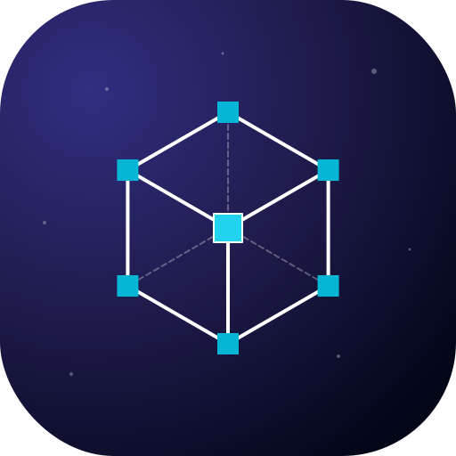

<div align="center">
  

  # VectorFusion

  **A simple, free, and open-source SVG studio for designers and developers.**

  Live code editing • Styling & gradients • Auto path separation • ViewBox cropping • Image export

  <!-- Core badges -->
  [](https://opensource.org/licenses/MIT)
  [](https://react.dev)
  [](https://www.typescriptlang.org/)
  [](https://tailwindcss.com/)

  <!-- Privacy badges -->
  
  
  
</div>

---

## 🚀 Introduction

**VectorFusion** is a lightweight SVG editor focused on modifying existing vector graphics — not drawing them from scratch.

You can:
- View and modify SVG code in real time
- Edit fill, stroke, gradients, opacity, and attributes
- Delete paths and elements
- Separate compound paths and automatically assign IDs
- Crop the ViewBox without losing quality
- Export to raster formats at high resolution

You **cannot** draw new shapes or edit vector nodes/curves. VectorFusion is designed for editing and cleaning SVGs quickly and visually — not illustration.

> VectorFusion is **100% client-side** — it works fully offline, and while you can upload and export files, all processing stays in your browser. Nothing is ever sent to a server.

---

## ✨ Key Features

- ⚡ **Live Code ↔ Preview** — Monaco editor synced with an interactive SVG canvas
- 🎨 **Styling Tools** — Fill, stroke, width, opacity, and gradient editing
- 🧠 **Auto Analyzer** — Split compound paths and assign IDs to disconnected shapes
- 🖱️ **Click-to-Code Linking** — Select an element in the preview to jump to its source
- 🔲 **ViewBox Cropper** — Resize non-destructively with drag handles or numeric inputs
- 📸 **High-Resolution Export** — PNG / JPEG / WEBP up to 4K+ (and Beyond)
- 🔒 **Privacy-First** — 100% local and offline-capable. No servers, no tracking, no telemetry.

---

## 📦 Modules

### 🛠 Code Studio
- Intelligent path separation + Auto-ID assignment
- Gradient editor (linear + radial)
- Click-to-edit inside the preview
- Output React JSX, React Native, Data URI

### ✂️ Cropper
- Adjust X/Y coordinates, width, height
- Drag handles for quick cropping
- Keep-Selection/Cut-Out modes

### 🖼 Exporter
- PNG / JPEG / WEBP output
- Custom Resolution
- Aspect ratio lock

---

## ⚡ Getting Started

```bash
git clone https://github.com/OracleMythix/VectorFusion.git
cd VectorFusion
npm install
npm run dev
```

---

## 🛠 Tech Stack

| Category | Tools |
|---------|-------|
| Framework | React 19 |
| Build | Vite |
| Language | TypeScript |
| Styling | Tailwind CSS |
| Editor | Monaco |
| Icons | Lucide React |

---

## 🙋 Contributing

VectorFusion is a **solo project** and is **not accepting external pull requests** at this time.  
Bug reports and feature ideas are welcome via **Issues**.

---

## 📝 License

Distributed under the MIT License.  
See `LICENSE` for details.

<div align="center">
  <small>Created by OracleMythix</small>
</div>